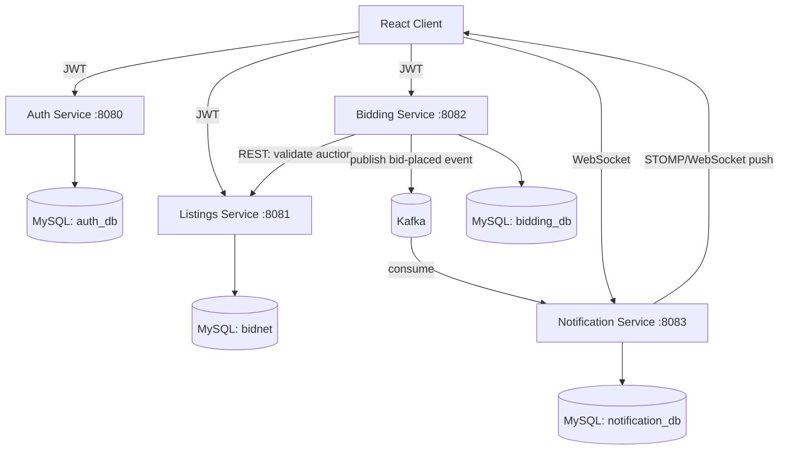

# BidNest — Real-Time Auction Platform

A full-stack, microservices-based auction platform built to practice production-style backend architecture: JWT authentication, event-driven communication, real-time updates, and cross-service coordination.

## Overview

BidNest lets sellers list items for auction and bidders compete in real time. Bids are validated against live auction data across services, outbid events are pushed instantly via WebSocket, and the whole system is decomposed into four independently deployable Spring Boot microservices.

## Architecture



**Flow summary:**
1. User registers/logs in via **Auth Service** → receives a JWT (subject = userId UUID, claim = role).
2. Seller creates/manages auctions via **Listings Service** (ownership + status state machine enforced).
3. Bidder places a bid via **Bidding Service**, which validates the bid against live auction data fetched from Listings Service over REST, and against its own bid history (source of truth for current highest bid).
4. On a new highest bid, Bidding Service publishes a `bid-placed` event to **Kafka**.
5. **Notification Service** consumes the event, logs it, and pushes a live "you've been outbid" alert to the previous highest bidder via WebSocket/STOMP.

Each service independently validates JWTs (no API gateway) and owns its own MySQL database — no shared tables or direct DB access across services.

## Tech Stack

| Layer | Technology |
|---|---|
| Language / Framework | Java 17, Spring Boot |
| Security | Spring Security, JWT (JJWT), BCrypt |
| Data | Spring Data JPA, MySQL (one schema per service) |
| Messaging | Apache Kafka |
| Real-time | WebSocket, STOMP |
| Inter-service calls | RestTemplate |
| Containerization | Docker, Docker Compose |
| Testing | JUnit 5, Mockito |

## Services

### Auth Service (`:8080`)
Registration, login, JWT issuance. JWT subject is the user's UUID (not email), with `role` as a custom claim.

- `POST /user/register`
- `POST /user/login`

### Listings Service (`:8081`)
Auction CRUD, ownership enforcement, and a `DRAFT → ACTIVE → CLOSED/CANCELLED` status state machine.

| Method | Endpoint | Role |
|---|---|---|
| POST | `/api/auctions` | SELLER |
| GET | `/api/auctions` | Authenticated |
| GET | `/api/auctions/{id}` | Authenticated |
| GET | `/api/auctions/ending-soon` | Authenticated |
| PUT | `/api/auctions/{id}` | SELLER (owner) |
| PATCH | `/api/auctions/{id}/status` | SELLER (owner) / ADMIN |
| GET | `/api/auctions/seller/{sellerId}` | Authenticated |

### Bidding Service (`:8082`)
Bid placement with live validation, proxy (max) bid storage, and Kafka event publishing.

| Method | Endpoint | Role |
|---|---|---|
| POST | `/api/bids` | BIDDER |
| GET | `/api/bids/auction/{auctionId}` | Authenticated |
| GET | `/api/bids/my-bids` | BIDDER |
| GET | `/api/bids/auction/{auctionId}/highest` | Authenticated |
| POST | `/api/proxy-bids` | BIDDER |
| DELETE | `/api/proxy-bids/{auctionId}` | BIDDER (owner) |
| GET | `/api/proxy-bids/my-proxy-bids` | BIDDER |

### Notification Service (`:8083`)
Kafka consumer + WebSocket push for real-time outbid alerts, plus notification history.

| Method | Endpoint | Role |
|---|---|---|
| GET | `/api/notifications/my-notifications` | Authenticated |
| PATCH | `/api/notifications/{id}/read` | Authenticated (owner) |

WebSocket endpoint: `ws://localhost:8083/ws` (STOMP over SockJS)

## Security Model

- Only Auth Service issues JWTs; every other service validates independently using a shared signing secret — no gateway, no per-request calls back to Auth.
- JWT subject = user's UUID, so downstream services never need to resolve email → ID.
- Two authorization layers per protected write endpoint:
    1. **Role check** (Spring Security `hasRole(...)`) — is this role allowed to call this endpoint at all?
    2. **Ownership check** (service-layer logic) — does this specific resource belong to the caller?

## Running Locally

### Prerequisites
- Java 17
- Maven
- MySQL 8
- Docker (for Kafka/Zookeeper, or full docker-compose)

### Option A — Docker Compose (all services + infra)
```bash
docker compose up --build
```

### Option B — Run services individually
1. Start MySQL and create the 4 schemas (`auth_db`, `bidnet`, `bidding_db`, `notification_db`).
2. Start Kafka + Zookeeper:
   ```bash
   docker compose up zookeeper kafka -d
   ```
3. Run each service (in separate terminals/IDE run configs):
   ```bash
   cd AuthService && mvn spring-boot:run
   cd ListingsService && mvn spring-boot:run
   cd BiddingService && mvn spring-boot:run
   cd NotificationService && mvn spring-boot:run
   ```

### Configuration
Each service reads DB/Kafka connection info from `src/main/resources/application.properties`. Copy `application.properties.example` (if present) and fill in local values, or set environment variables (`SPRING_DATASOURCE_URL`, `SPRING_KAFKA_BOOTSTRAP_SERVERS`, `JWT_SECRET`) which override file-based config.

## Example Flow (Postman)

1. `POST :8080/user/register` — create a SELLER and a BIDDER account
2. `POST :8080/user/login` — get JWT for each
3. `POST :8081/api/auctions` (SELLER token) — create an auction
4. `PATCH :8081/api/auctions/{id}/status` (SELLER token) — set status to `ACTIVE`
5. `POST :8082/api/bids` (BIDDER token) — place a bid
6. `GET :8083/api/notifications/my-notifications` — check if the previous highest bidder was notified

## Project Status / Roadmap

- [x] Auth, Listings, Bidding, Notification services — core logic complete
- [x] JWT + RBAC + ownership checks across all services
- [x] Kafka event pipeline (bid-placed → outbid notification)
- [x] WebSocket real-time push
- [x] Dockerfiles + docker-compose for full local orchestration
- [ ] Automated proxy-bid competition engine (currently stores max bid; auto-raising not yet implemented)
- [ ] Integration tests for Bidding/Notification services (Auth Service has unit/integration coverage)
- [ ] React frontend
- [ ] CI/CD (GitHub Actions)
- [ ] Kubernetes manifests

## Author

Built by [aki-raa](https://github.com/aki-raa) as a hands-on practice project covering microservices architecture, event-driven systems, and real-time communication patterns.